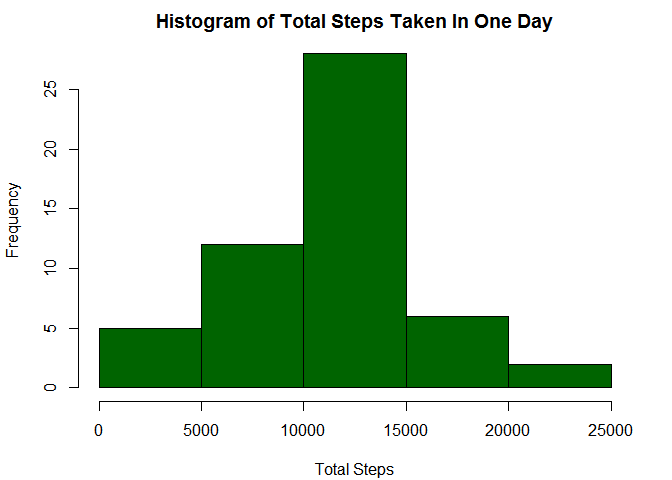
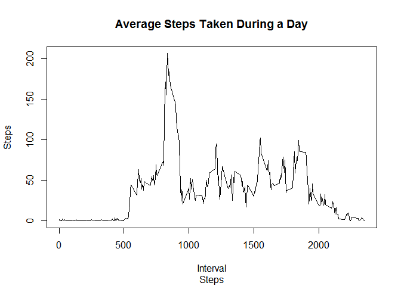
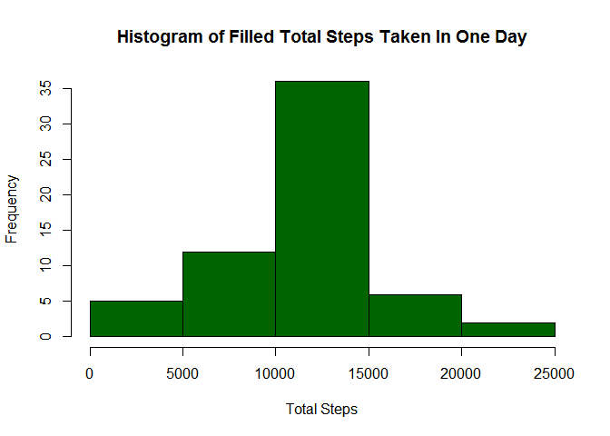
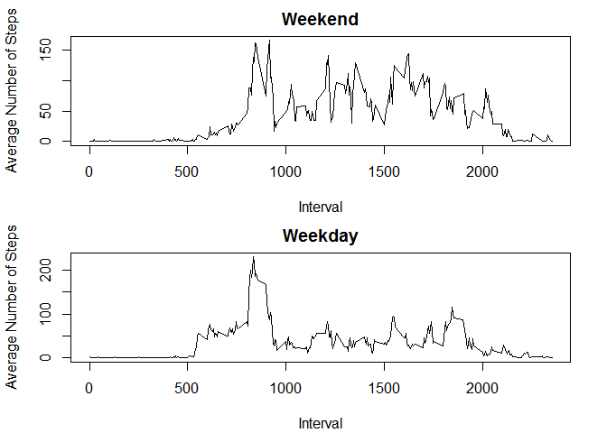

# Reproducible Research: Peer Assessment 1

####Author: Jessica Alana James 
####Date: 06/14/2015


## Loading and preprocessing the data

```r
setwd("~/Programming/R/Coursera/Reproducible Research")
AMD <- read.csv("./data/activity.csv", 
                col.names = c("Steps", "Date", "Interval"), 
                colClasses = c("integer", "character", "character"))
```

## What is mean total number of steps taken per day?
1. Calculate the total number of steps taken per day.

```r
stepsPerDay <- aggregate(Steps ~ Date, sum, data=AMD, na.rm = TRUE)
```

2. Make a histogram of the total number of steps taken each day.

```r
par(mfrow = c(1, 1))
par(mar = c(4.1, 4.1, 2.1, 2.1))
hist(stepsPerDay$Steps,
     breaks = (nrow(stepsPerDay)/10),
     main = "Histogram of Total Steps Taken In One Day",
     xlab = "Total Steps",
     col = I("dark green"),
     border = I("black"))
```

 

3. Calculate and report the mean and median of the total number of steps taken per day.

```r
sorted.AMD <- AMD[order(AMD$Date, AMD$Steps, AMD$Interval), ]
meanspd <- ddply(sorted.AMD, .(Date), summarise, 
                 Mean = as.integer(mean(Steps, na.rm = TRUE)))
medianspd <- ddply(subset(sorted.AMD, Steps > 0, na.rm = TRUE), 
                   .(Date), summarise, Median = as.integer(median(Steps)))
perDays <- merge(meanspd, medianspd, by = "Date", all = TRUE)
colnames(perDays) <- c("Date", "Mean Steps", "Median Steps")
kable(perDays, format = "markdown", padding = 0)
```


|Date      |Mean Steps|Median Steps|
|:---------|---------:|-----------:|
|2012-10-01|        NA|          NA|
|2012-10-02|         0|          63|
|2012-10-03|        39|          61|
|2012-10-04|        42|          56|
|2012-10-05|        46|          66|
|2012-10-06|        53|          67|
|2012-10-07|        38|          52|
|2012-10-08|        NA|          NA|
|2012-10-09|        44|          48|
|2012-10-10|        34|          56|
|2012-10-11|        35|          35|
|2012-10-12|        60|          46|
|2012-10-13|        43|          45|
|2012-10-14|        52|          60|
|2012-10-15|        35|          54|
|2012-10-16|        52|          64|
|2012-10-17|        46|          61|
|2012-10-18|        34|          52|
|2012-10-19|        41|          74|
|2012-10-20|        36|          49|
|2012-10-21|        30|          48|
|2012-10-22|        46|          52|
|2012-10-23|        30|          56|
|2012-10-24|        29|          51|
|2012-10-25|         8|          35|
|2012-10-26|        23|          36|
|2012-10-27|        35|          72|
|2012-10-28|        39|          61|
|2012-10-29|        17|          54|
|2012-10-30|        34|          40|
|2012-10-31|        53|          83|
|2012-11-01|        NA|          NA|
|2012-11-02|        36|          55|
|2012-11-03|        36|          59|
|2012-11-04|        NA|          NA|
|2012-11-05|        36|          66|
|2012-11-06|        28|          52|
|2012-11-07|        44|          58|
|2012-11-08|        11|          42|
|2012-11-09|        NA|          NA|
|2012-11-10|        NA|          NA|
|2012-11-11|        43|          55|
|2012-11-12|        37|          42|
|2012-11-13|        25|          57|
|2012-11-14|        NA|          NA|
|2012-11-15|         0|          20|
|2012-11-16|        18|          43|
|2012-11-17|        49|          65|
|2012-11-18|        52|          80|
|2012-11-19|        30|          34|
|2012-11-20|        15|          58|
|2012-11-21|        44|          55|
|2012-11-22|        70|          65|
|2012-11-23|        73|         113|
|2012-11-24|        50|          65|
|2012-11-25|        41|          84|
|2012-11-26|        38|          53|
|2012-11-27|        47|          57|
|2012-11-28|        35|          70|
|2012-11-29|        24|          44|
|2012-11-30|        NA|          NA|

## What is the average daily activity pattern?
1. Make a time series plot (i.e. type = "l") of the 5-minute interval (x-axis) and the average number of steps taken, averaged across all days (y-axis)
        

```r
meanPerInterval <- aggregate(Steps ~ Interval, mean, data=AMD, na.rm = TRUE)
sortedMPI <- meanPerInterval[order(as.integer(meanPerInterval$Interval)), ]
plot(sortedMPI, aes(x=Interval, y = Steps), type = "l",
     main="Average Steps Taken During a Day")
```

 

2. Which 5-minute interval, on average across all the days in the dataset, contains the maximum number of steps?
        

- The interval with the maximum number of steps is 835 with ~206 steps.  


## Imputing missing values

1. Calculate and report the total number of missing values in the dataset (i.e. the total number of rows with NAs) 
        Since there are only NAs in the Steps column, counting the number of NAs in the entire data frame is equivalent to counting the rows with a NA Steps value.
        

```r
sumNAs <- sum(is.na(AMD))
```
- There are 2304 missing values in the dataset.   

2. Devise a strategy for filling in all of the missing values in the dataset. The strategy does not need to be sophisticated. For example, you could use the mean/median for that day, or the mean for that 5-minute interval, etc. 
        
*Note: The NA values will be replaced with the means for each interval over all days.*  
        
3. Create a new dataset that is equal to the original dataset but with the missing data filled in.


```r
naRows <- AMD[which(is.na(AMD$Steps)==TRUE),]
rows <- rownames(AMD) %in% rownames(naRows)
newAMD <- AMD
newAMD[rows, "Steps"] <- sortedMPI[, "Steps"]
```
 
4. Make a histogram of the total number of steps taken each day and Calculate and report the mean and median total number of steps taken per day. Do these values differ from the estimates from the first part of the assignment? What is the impact of imputing missing data on the estimates of the total daily number of steps? 


```r
newSPD <- aggregate(Steps ~ Date, sum, data=newAMD, na.rm = TRUE)

hist(newSPD$Steps,
     breaks = (nrow(stepsPerDay)/10),
     main = "Histogram of Filled Total Steps Taken In One Day",
     xlab = "Total Steps",
     col = I("dark green"),
     border = I("black"))
```

 
- The central frequencies are slightly raised but the overall spread is the same. The impact is a decrease in the ratio of outliers.  


## Are there differences in activity patterns between weekdays and weekends?

1. Create a new factor variable in the dataset with two levels - "weekday" and "weekend" indicating whether a given date is a weekday or weekend day.

*Note: The factor variable was not used, but rather a weekday value between 0 and 6. The determination of weekend versus weekday is then made before plotting*


```r
WD <- as.integer((as.POSIXlt(as.Date(newSPD$Date), "GMT")$wday))
newSPD <- mutate(newSPD, WD = WD)
```

2. Make a panel plot containing a time series plot (i.e. type = "l") of the 5-minute interval (x-axis) and the average number of steps taken, averaged across all weekday days or weekend days (y-axis). See the README file in the GitHub repository to see an example of what this plot should look like using simulated data.

*Note: PosixLt.wday of 0 is Sunday, and 6 is Saturday*


```r
days <- list(0,6)
WD <- as.integer((as.POSIXlt(as.Date(newAMD$Date), "GMT")$wday))
newAMD <- mutate(newAMD, WD = WD)
weekendSteps <- newAMD[newAMD$WD %in% days, ]
weekSteps <- newAMD[! newAMD$WD %in% days, ]
meanWEPI <- aggregate(Steps ~ Interval, mean, data=weekendSteps, na.rm = FALSE)
meanWPI <- aggregate(Steps ~ Interval, mean, data=weekSteps, na.rm = FALSE)
sortedWEPI <- meanWEPI[order(as.integer(meanWEPI$Interval)), ]
sortedWPI <- meanWPI[order(as.integer(meanWPI$Interval)), ]
with(sortedWPI, {
    par(mfrow = c(2, 1))
    par(mar = c(4.1, 4.1, 2.1, 2.1))
plot(sortedWEPI$Interval, 
     sortedWEPI$Steps,
     xlab = "Interval",
     ylab = "Average Number of Steps", col = "black",
     main = "Weekend", axes = TRUE, type="l")
plot(sortedWPI$Interval, 
     sortedWPI$Steps,
     xlab = "Interval",
     ylab = "Average Number of Steps", col = "black",
     main= "Weekday", axes = TRUE, type="l")
})
```

 
- Weekend steps are spread throughout the day, while Weekday steps are primarily in the morning. 

